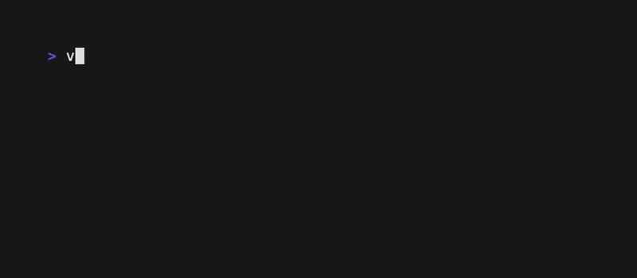

# jieba.vim: Vim/Nvim 的中文按词跳转插件

[](https://github.com/kkew3/jieba.vim/actions/workflows/ci.yml)
[](https://codecov.io/github/kkew3/jieba.vim)

> 为 Vim/Neovim 提供基于 [jieba][jieba] 的 word motion / text object 增强。

<em>For English, see <a href="#en">below</a>.</em>

[](./docs/demo/README.md)

## 核心特性

- 混合架构：Vimscript 负责集成，Rust 核心通过 cdylib 提供高性能分词；预编译二进制托管于 [GitHub Releases][releases]，覆盖主流平台。两者通过 python3 (Vim) 或 lua5.1 (Neovim) 桥接。
- 兼容性保障：48,000+ 自动化 Vim 用例验证，确保在纯 ASCII 文本中与原生 word motions / text objects 行为完全一致。
- 完整支持：全部 12 个 word motions / text objects（`w` / `W` / `b` / `B` / `e` / `E` / `ge` / `gE` / `iw` / `iW` / `aw` / `aW`），覆盖 normal / visual / operator-pending 模式，支持计数前缀与所有字符操作，支持 register，以及通过 [`tpope/vim-repeat`][vim-repeat] 支持 [`.`][dot-repeat] 重复上一操作。
- 灵活配置：尊重 [`'iskeyword'`][isk] 设置，允许自定义分词边界；支持惰性加载词典，按需启用。
- 帮助文档：可使用 `:h jieba` 在 Vim/Nvim 内查看帮助。

## 安装

### 环境要求

- Vim 8/9：需要 `+python3` 或 `+python3/dyn` 或 `+python3/dyn-stable`。
- Neovim：无额外依赖。

[vim-plug][vim-plug] (Vim / Neovim):

```vim
Plug 'kkew3/jieba.vim', { 'branch': 'release', 'do': { -> jieba_vim#install() } }
```

[lazy.nvim][lazy-nvim] (Neovim):

```lua
{
    "kkew3/jieba.vim",
    branch = "release",
    build = ":call jieba_vim#install()",
    init = function()
      vim.g.jieba_vim_lazy = 1
      vim.g.jieba_vim_keymap = 1
    end,
},
```

其中，`jieba_vim#install()` 优先下载预编译 cdylib，下载失败时回退至本地编译（需要 [cargo][cargo]）。

## 功能

### 增强的 Word Motions / Text Objects

- 在保留原生语义（如 `w` 不跳过标点、`W` 跳过标点）的基础上，使以下命令识别中文词语：
  * Word motions: `b`、`B`、`ge`、`gE`、`w`、`W`、`e`、`E`
  * Text objects: `iw`、`iW`、`aw`、`aW`
- 支持所有模式：`nmap` / `xmap` / `omap`（text object 没有 `nmap`）；
- 支持计数：`4w`、`c2e`、`3daw` 等；
- 支持所有字符操作：`d`、`c`、`y`、`g~` 等；
- 安装有 [`tpope/vim-repeat`][vim-repeat] 时可以使用 `.` 重复上一操作：`dw.` 相当于 `dwdw`。

### 跳转预览

可提前高亮 `nmap` 下的光标跳转位置：

```vim
" 示例映射
nmap <LocalLeader>jw <Plug>(Jieba_preview_w)
nmap <LocalLeader>je <Plug>(Jieba_preview_e)
" 取消预览
nmap <LocalLeader>jc <Plug>(Jieba_preview_cancel)
```

另提供 `:JiebaPreviewCancel` 命令用于取消按词跳转位置预览。

> 当前暂不支持预览 text objects。

### 非侵入式设计

默认**不映射任何按键**，通过 `<Plug>(Jieba_*)` 映射与命令供用户自由配置。若希望快速启用默认行为（不包括跳转预览），可在 `~/.vimrc` 中：

```vim
let g:jieba_vim_keymap = 1
```

## 配置选项

| 选项 | 说明 | 默认值
|---|---|---|
| `g:jieba_vim_lazy`| 是否延迟加载词典直到中文出现 | `1`（是） |
| `g:jieba_vim_user_dict` | 用户自定义词典路径 | `""` |
| `g:jieba_vim_keymap` | 是否自动启用默认键映射 | `0`（否） |

## 开发者

若想在本地运行针对 rust 实现的测试，部分测试可通过如下命令运行：

```bash
cargo test --locked -r --manifest-path rust_backend/Cargo.toml
```

其余测试比较复杂，请参见 [CI](./.github/workflows/ci.yml)。

## Roadmap

见 [TODO.md](./TODO.md)。

## FAQ

见 [docs/faq.md](./docs/faq.md)。

## 在本地复现 Demo 动图

见 [docs/demo](./docs/demo/README.md).

## 相关项目

见 [docs/related-projects.md](./docs/related-projects.md)。

## 许可

Apache license v2；部分文件参照 [vim-LICENSE.txt](./vim-LICENSE.txt).

---

<div id="en">

# jieba.vim: Chinese Word Motion / Text Object Plugin for Vim/Nvim

## Core Features

- Hybrid Architecture: Vimscript handles integration while the Rust core delivers high-performance word segmentation via cdylib; precompiled binaries are hosted on [GitHub Releases][releases], covering major platforms. Rust and Vimscript are bridged by python3 (Vim) or lua5.1 (Neovim).
- Compatibility Assurance: 48,000+ automated Vim test cases ensure behavior fully consistent with native word motions / text objects when handling pure ASCII text.
- Complete Support: All 12 word motions / text objects (`w` / `W` / `b` / `B` / `e` / `E` / `ge` / `gE` / `iw` / `iW` / `aw` / `aW`), covering normal / visual / operator-pending modes, supporting count prefixes and all character operators, supporting registers, and supporting [`.`][dot-repeat] to repeat the last operation via [tpope/vim-repeat][vim-repeat].
- Flexible Configuration: Respects [`'iskeyword'`][isk] settings, allowing custom word boundary definitions; supports lazy-loading dictionaries, enabling on-demand activation.
- Help documentation: Check the help documentation with `:h jieba` within Vim/Nvim.

## Installation

### Prerequisites

- Vim 8/9: require `+python3` or `+python3/dyn` or `+python3/dyn-stable`.
- Neovim: no additional dependency.

[vim-plug][vim-plug] (Vim / Neovim):

```vim
Plug 'kkew3/jieba.vim', { 'branch': 'release', 'do': { -> jieba_vim#install() } }
```

[lazy.nvim][lazy-nvim] (Neovim):

```lua
{
    "kkew3/jieba.vim",
    branch = "release",
    build = ":call jieba_vim#install()",
    init = function()
      vim.g.jieba_vim_lazy = 1
      vim.g.jieba_vim_keymap = 1
    end,
},
```

Here, `jieba_vim#install()` prioritizes downloading the precompiled cdylib, falling back to local compilation (requires [cargo][cargo]) if the download fails.

## Functions

### Extended Word Motions / Text Objects

- While preserving native semantics (e.g., `w` does not skip punctuation, whereas `W` does), the following commands are enhanced to recognize Chinese words:
  * Word motions: `b`、`B`、`ge`、`gE`、`w`、`W`、`e`、`E`
  * Text objects: `iw`、`iW`、`aw`、`aW`
- Supports all modes: `nmap` / `xmap` / `omap` (text objects have no `nmap`);
- Supports counts: `4w`, `c2e`, `3daw`, etc.;
- Supports all character operators: `d`, `c`, `y`, `g~`, etc.;
- When [tpope/vim-repeat][vim-repeat] is installed, `.` can be used to repeat the last operation: `dw.` is equivalent to `dwdw`.

### Cursor movement preview

Cursor movements under `nmap` can be previewed in advance:

```vim
" Example mappings
nmap <LocalLeader>jw <Plug>(Jieba_preview_w)
nmap <LocalLeader>je <Plug>(Jieba_preview_e)
" Cancel preview
nmap <LocalLeader>jc <Plug>(Jieba_preview_cancel)
```

Additionally, the `:JiebaPreviewCancel` command is provided to cancel word motion previews.

> Preview for text objects is currently not supported.

### Non-intrusive Design

By default, no keys are mapped; users can freely configure via `<Plug>(Jieba_*)` mappings and commands. If you wish to quickly enable default behavior (excluding cursor movement preview), add the following to `~/.vimrc`:

```vim
let g:jieba_vim_keymap = 1
```

## Configuration Options

| Option | Description | Default |
|---|---|---|
| `g:jieba_vim_lazy` | Whether to delay loading the dictionary until Chinese characters appear | `1` (yes) |
| `g:jieba_vim_user_dict` | Path to user-defined custom dictionary | `""` |
| `g:jieba_vim_keymap` | Whether to automatically enable default key mappings | `0` (no) |

## For Developers

To run tests against the Rust implementation locally, a portion of tests can be executed with the following command:

```bash
cargo test --locked -r --manifest-path rust_backend/Cargo.toml
```

For the remaining, please refer to [CI](./.github/workflows/ci.yml).

## Roadmap

See [TODO.md](./TODO.md).

## FAQ

See [docs/faq.md](./docs/faq.md).

## Reproducing the demo gif locally

See [docs/demo](./docs/demo/README.md).

## Related Projects

See [docs/related-projects.md](./docs/related-projects.md)

## License

Apache License v2; with a handful of files following [vim-LICENSE.txt](./vim-LICENSE.txt).


[jieba]: https://github.com/fxsjy/jieba
[vim-plug]: https://github.com/junegunn/vim-plug
[vim-repeat]: https://github.com/tpope/vim-repeat
[dot-repeat]: https://vimhelp.org/repeat.txt.html#.
[lazy-nvim]: https://lazy.folke.io
[cargo]: https://rust-lang.org/tools/install/
[releases]: https://github.com/kkew3/jieba.vim/releases
[isk]: https://vimhelp.org/options.txt.html#%27iskeyword%27
