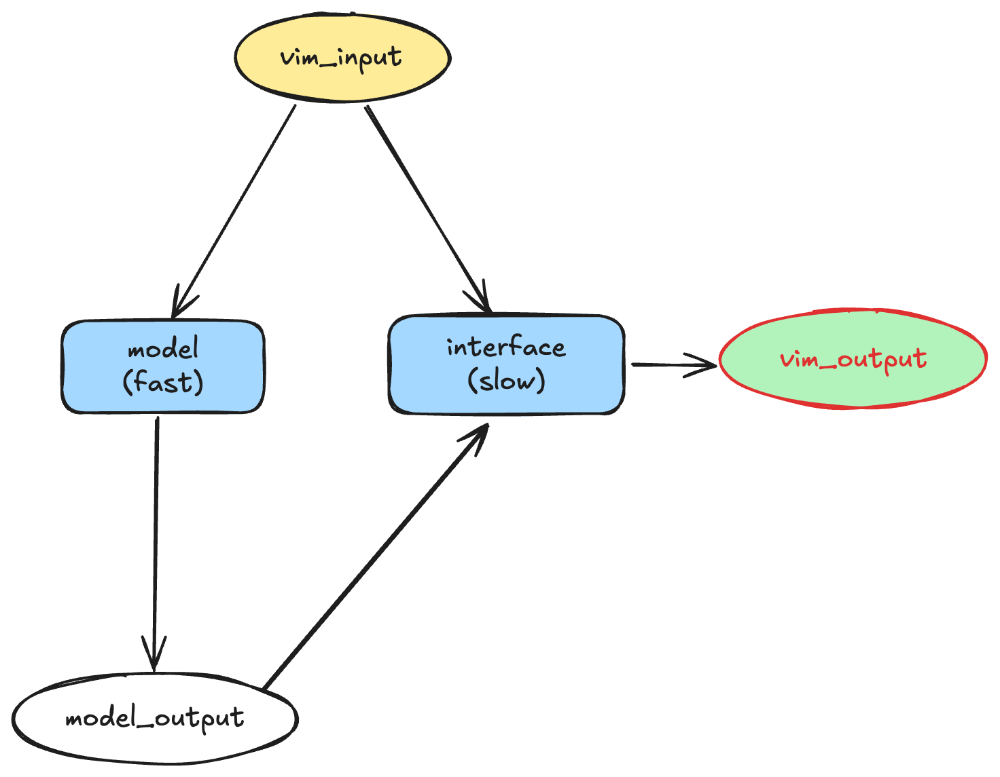
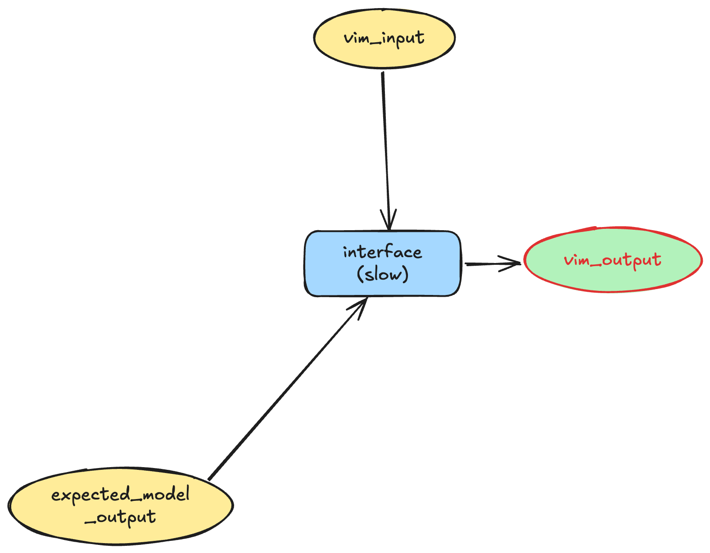

# Simplify CI test pipeline

Date: April 27, 2026 | Author: Kaiwen Wu

## Background

Plugin `jieba.vim` is composed of a fast Rust model $m$ and a slow vimscript interface $d$.
Given raw Vim input $x$, the plugin $(m,d): x \mapsto d(x, m(x))$.
Collecting a testset of groundtruth input/output pairs $\mathcal{D}_v = \{(x_i, y_i)\}_{i=1}^N$ from a Vim runtime $v$, the design goal is to find a $p = (m,d)$ such that $p(x_i) = y_i$, $\forall (x_i,y_i) \in \mathcal{D}_v$, subject to some performance constraint (e.g. Wall time upper bound).
We will thereafter omit the performance constraint for brevity.

## Origin of `unit_verification`

Jointly finding $p = (m,d)$ is difficult due to the coupling.
In contrast, if we are able to a posterior obtain a (promising) guess of the latent `model_output` $z_i$ (e.g. by human labor), then we decouple the joint decision into two much easier problems: finding $m$ such that $m(x_i) = z_i$, and finding $d$ such that $d(x_i, z_i) = y_i$.
Immediately, if such $(m,d)$ exists, then it's a solution to the original problem.
This decouping is exactly the scaffolding behind current `unit_verification`.

## Current test pipeline

1. Out of a set of Vim runtimes to support $V$, we select one $u \in V$, and collect behavioral testset $\mathcal{D}_u$.
2. For each $(x_i, y_i) \in \mathcal{D}_u$, we run $z_i = m(x_i)$ and assert that $d(x_i, z_i) = y_i$. If the assertion holds, then we obtain a witness $z_i$. Note: this process is called `bootstrap_verification`.
3. $\forall v \in V$, $\forall (x_i, y_i) \in \mathcal{D}_v$, we run `unit_verification` on $(x_i, y_i)$ given the witness $z_i$.

It's easy to show that if $p = (m,d)$ survives, then $p$ is a solution.

## Proposed simplified pipeline

We designed the pipeline above in order to build on the concept of `unit_verification`.
While it may help in developing $p$ especially when neither $m$ and $d$ functions properly, if we think carefully in terms of the sole purpose of CI in gatekeeping the implementation, it's unnecessarily complex and restrictive.
In fact, a better alternative is more direct and obvious:

> $\forall v \in V$, $\forall (x_i, y_i) \in \mathcal{D}_v$, assert $p(x_i) = y_i$.

Arguments:

- The original pipeline runs $p$ over $N (1+|V|)$ I/O pairs, whereas the new one runs over $N |V|$ pairs, saving compute on $N$ pairs.
- The original pipeline allows false alarm to exist, when the actual latent is not equal to the witness.
- The new pipeline retains the ability to compute test coverage of $m$ based on $\{(x_i, m(x_i))\}$ where $p(x_i) = y_i$.

We name this new single-step test `basic_integrated_verification`, and propose to deprecate `bootstrap_verification` in favor of the new test.
We may keep `unit_verification` around for some time in case it helps develop new features (e.g. new key mappings).
